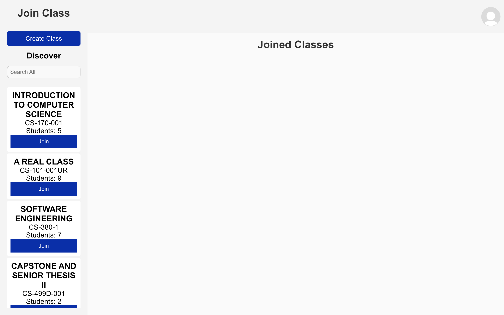
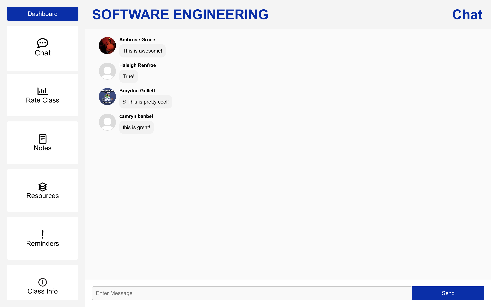
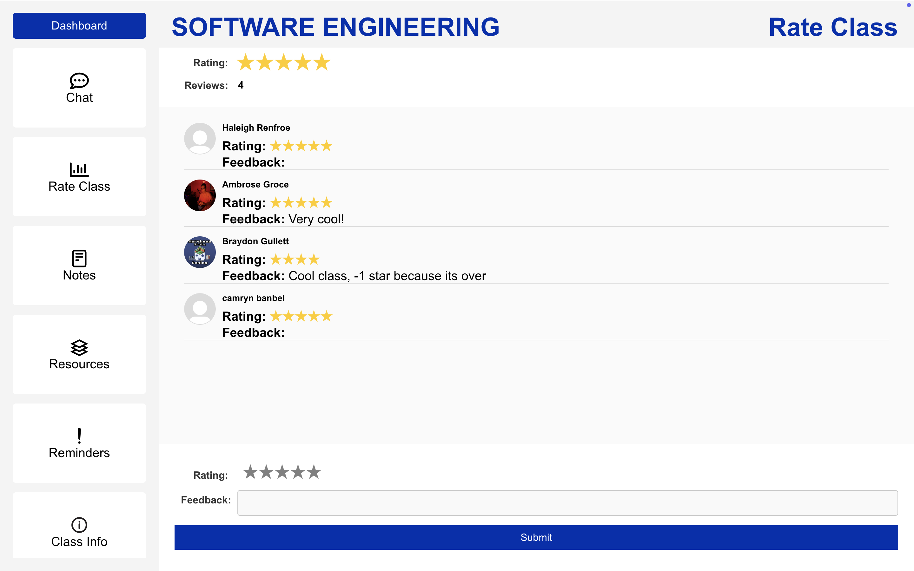
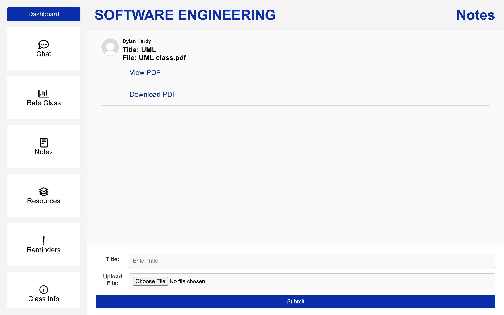
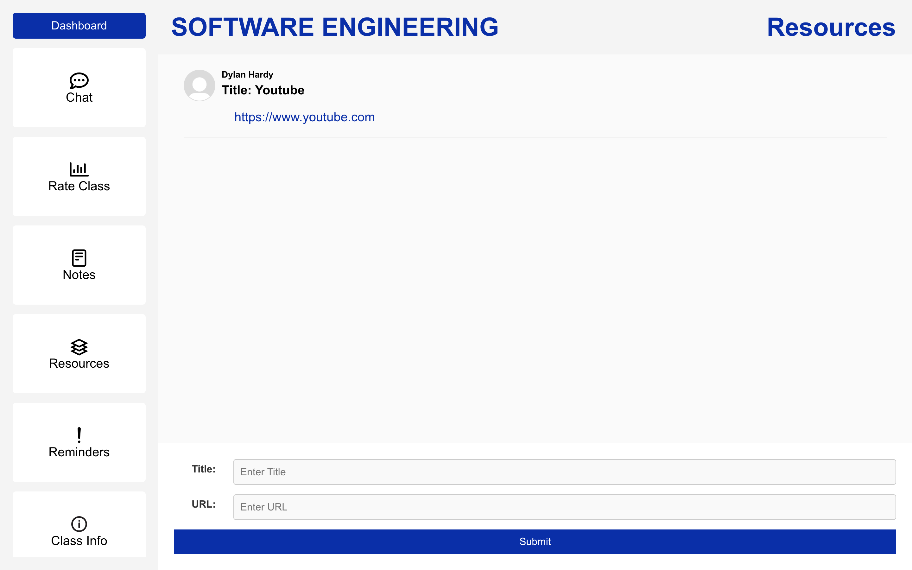
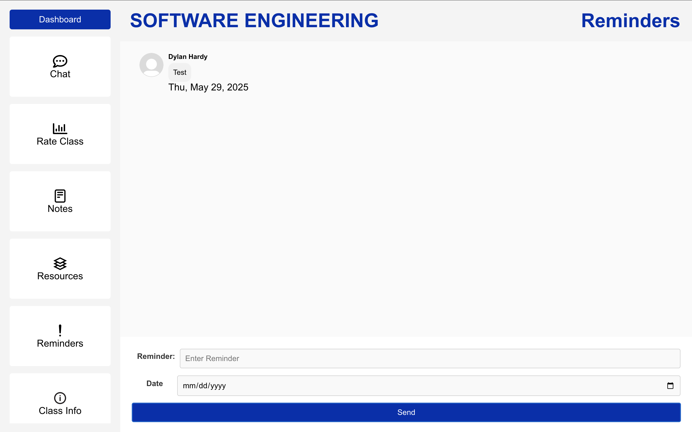

# 🦅 Eagle Connect App

**Eagle Connect** is a web application built for **Morehead State University (MSU)** students to connect with one another and join groups based on their classes and interests.

---

## 🚀 Features

- Create and join groups based on courses  
- Connect and message other MSU students  
- Responsive UI built with **React.js**  
- Real-time data and authentication with **Firebase**

---

 ## 🛠 Tech Stack
 
- Frontend: React.js
-Backend / Database: Firebase (Authentication, Firestore)
-Other Tools: Node.js, npm

---

## 🖼️ Screenshots








---


## 📦 How to Install

- Clone the repository:

```bash
git clone https://github.com/your-username/eagle-connect.git
```

- Open the folder in terminal
- Run sh install_script.sh


## 🏃 Run The App
- change directory to code/react-auth-tutorial/new2
- run npm start
'''


